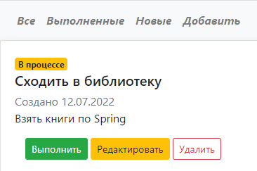

В этом задании  необходимо создать приложение "TODO список".

Стек технологий: Spring boot, Thymeleaf, Bootstrap, Hibernate, PostgreSql
1. Cхема таблицы item с полями id, description, created, done. Расположение /db/
2. Виды.
    - Страница со списком всех заданий. В таблице отображаем имя, дату создания и состояние (выполнено или нет)
    - На странице со списком добавить кнопку "Добавить задание".
    - На странице со списком добавьте три ссылки: Все, Выполненные, Новые. При перевода по ссылкам в таблице нужно отображать: все задания, только выполненные или только новые.
    - При клике на задание переходим на страницу с подробным описанием.
    - На странице с подробным описанием добавить кнопки: Выполнено, Отредактировать, Удалить.
    - Если нажали на кнокпу выполнить, то задание переводиться в состояние выполнено.
    - Кнопка редактировать переводит пользователя на отдельную страницу для редактирования.
    - Кнопка удалить, удаляет задание и переходит на список всех заданий.
3. Приложение должно иметь три слоя: Контроллеры, Сервисы, Персистенции.
    - Объект SessionFactory создается один раз в классе Main с аннотацией @Bean. По аналогии с loadDabaseSource в проекте "Работа мечты".
    - Объект ItemStore принимает параметр SessionFactory через конструктор.
- Главная страница приложения

- Ввод новой заметки

- Редактирование заметки (2 варианта - на главной странице, и в форме профиля заметки)

- Форма профиля заметки (позволяет выполнить операции с заметкой - перевести в выполненные, отредактировать, удалить)

- На главной странице в меню задания сортируются - все, выполненные, выполняются.

